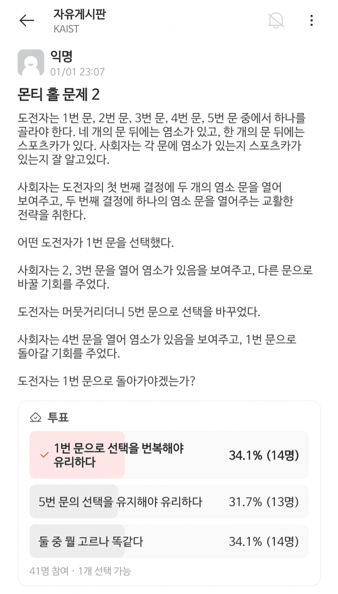

# 몬티 홀 문제 2 (Monty Hall v2)

## 1. 몬티 홀 v1 리뷰
기존의 몬티 홀 문제는 **3개의 문** 뒤에 자동차 1대와 염소 2마리가 있는 상황이다.
1. 참가자가 문 하나를 선택한다.
2. 사회자는 남은 문 중 염소가 있는 문 하나를 열어준다.
3. 참가자에게 선택을 유지하거나 바꿀 기회를 준다.

이때 선택을 바꾸면 승리 확률이 **1/3에서 2/3로 두 배 상승**한다는 사실은 잘 알려진 확률의 역설이다.

---

## 2. 몬티 홀 v2
이번에는 **5개의 문** 뒤에 자동차 1대와 염소 4마리가 있는 확장 모델을 고려해 보자.

### **상황 시나리오**
*   **시작**: 참가자는 **문 1**을 선택한다.
*   **진행 1**: 사회자는 문 2와 3을 열어 염소가 있음을 확인시켜 준다.
*   **선택 이동**: 몬티 홀의 원리를 아는 참가자는 유리하다고 판단되는 **문 5**로 선택을 바꾼다.
*   **진행 2**: 사회자는 다시 남은 문 중 **문 4**를 열어 염소를 보여준다.
*   **최종 결정**: 이제 참가자에게 문 5를 유지할지, 아니면 다시 **문 1로 재번복**할지 묻는다.

> **과연 참가자가 문 1로 재번복하면 자동차를 얻을 확률은 얼마일까?**

---

### **Step 1**

참가자가 문 1을 선택한 상태에서 사회자가 문 2, 3을 여는 사건을 $O_{2,3}$, 자동차가 문 $k$ 뒤에 있는 사건을 $C_k$라고 하자. 
베이즈 정리를 통해 문 5에 자동차가 있을 확률 $P(C_5|O_{2,3})$을 계산한다.

$$P(C_5|O_{2,3}) = \frac{P(O_{2,3}|C_5)P(C_5)}{P(O_{2,3})} = \frac{\frac{1}{3} \times \frac{1}{5}}{P(O_{2,3})}$$

여기서 전체 확률의 법칙으로 분모 $P(O_{2,3})$를 구하면:
$$P(O_{2,3}) = \frac{1}{5} \sum_{k=1}^{5}P(O_{2,3}|C_k) = \frac{1}{5} \times \left(\frac{1}{6} + 0 + 0 + \frac{1}{3} + \frac{1}{3}\right) = \frac{1}{6}$$

따라서 첫 번째 단계 이후 각 문에 자동차가 있을 확률은 다음과 같다.
*   **문 1**: $1/5$
*   **문 4, 5**: 각각 $2/5$
*   **문 2, 3**: $0$ (탈락)

이에 참가자는 확률이 높은 **문 5**로 선택을 옮겼다.

---

### **Step 2**

이제 상황은 문 1, 4, 5만 남은 상태에서의 몬티 홀 문제로 압축되었다.
문을 정리하면 다음과 같다.
- **문 1**: $1/5$, 참가자가 최초 선택한 문
- **문 4**: $2/5$, 그냥 문
- **문 5**: $2/5$, 참가자가 현재 선택한 문

#### Case 1. 자동차가 문 1에 있는 경우
이러한 경우는 $1/5$ 의 확률로 발생한다. 또한 사회자는 문 4를 열 수 밖에 없다. 따라서 참가자가 문 1로 재번복하면 자동차를 얻을 확률은 $1/5$ 이다.

#### Case 2. 자동차가 문 5에 있는 경우
이러한 경우는 $2/5$ 의 확률로 발생한다. 사회자는 문 1을 열수도, 문 4를 열수도 있다. 사회자가 문 4를 열더라도 참가자가 현재 선택한 문 5를 유지하면 자동차를 얻을 확률은 $2/5$ 이다.

#### Case 3. 자동차가 문 4에 있는 경우
이러한 경우는 $2/5$ 의 확률로 발생한다. 정말 그럴까? 사회자는 열 수 있는 문이 없다. 문 1은 문제의 상황을 만들 수 없으므로, 문 4는 현재 자동차가 있으므로, 문 5는 현재 참가자가 선택했으므로 시나리오 자체가 불가능하다. 따라서 이러한 경우는 $0$ 의 확률로 발생한다.

#### **검증**
마찬가지로 사회자가 문 4를 여는 사건을 $O_4$라 할 때, 베이즈 정리를 적용한다.

$$P(C_1|O_4) = \frac{P(O_4|C_1) P(C_1 | O_{2,3})}{P(O_4)} = \frac{1 \times \frac{1}{5}}{P(O_4)}$$

$$P(O_4) = P(O_4|C_1)P(C_1)+P(O_4|C_4)P(C_4)+P(O_4|C_5)P(C_5) = \frac{3}{5}$$

최종 계산 결과는 다음과 같다.
$$P(C_1|O_4) = \frac{1}{5} \times \frac{5}{3} = \frac{1}{3}$$

---

## 3. 결론

결론적으로, 참가자가 다시 문 1로 선택을 번복했을 때 자동차를 얻을 확률은 $1/3$ 이다. 

즉, **새로운 정보(문 4의 오픈)는 살아남은 선택지들 사이의 상대적 비율을 깨뜨리지 않고, 그 비중대로만 남은 확률을 재배분**한다는 것을 알 수 있다.

특히 **이러한 현상은 참가자가 문 1로 재번복이 가능한 상황을 기반으로 하기 때문에 발생한다.** 사회자가 문 1을 열지 않고 보존하여 참가자에게 다시 선택할 기회를 주었다는 사실 자체가 확률의 상대적 비율을 유지시키는 전제가 되며, 이 **재번복의 가능성이 살아있는 시나리오** 안에서만 위와 같은 확률적 배분이 성립하게 된다.

---
**log**
- 260411: 초고
- 260422: Case Work 추가