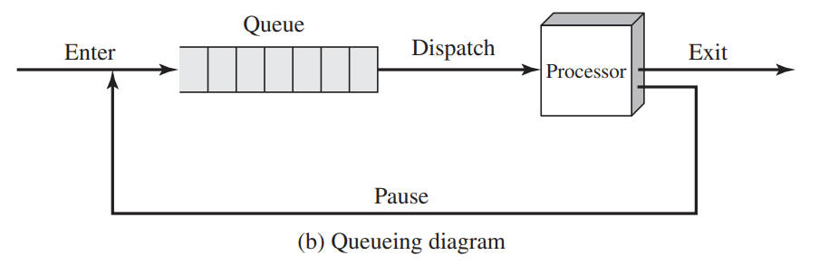
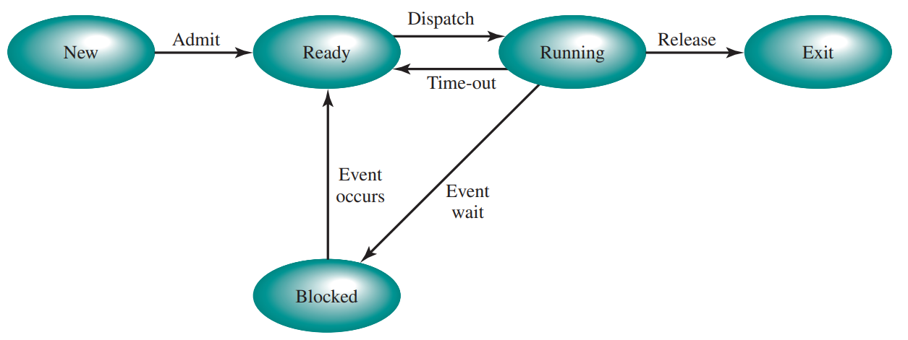
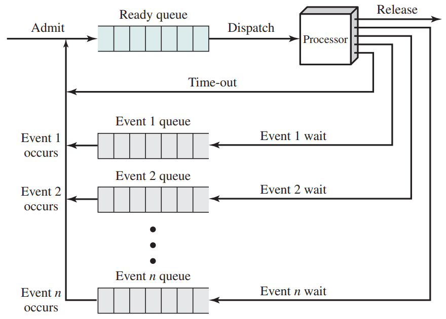
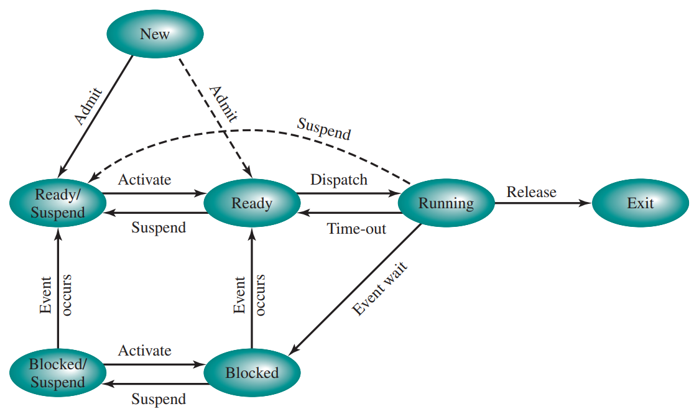

## 프로세스란 무엇인가?
`프로세스`는 실행중인 프로그램이다.

어플리케이션 실행시 필요로 하는 컴퓨터의 자원(프로세서, 메모리, I/O, 디스크)을 할당하고 관리하기 위해 프로세스 단위로 관리한다.

운영체제는 프로세스를 효율적으로 관리하기 위해 프로세스마다 `PCB`라는 정보를 관리한다.

### PCB (Process Control Block)
PCB는 다음과 같은 정보를 포함한다.
- **ID**: 프로세스를 구분하기 위한 고유한 식별자
- **상태**: 프로세스에 대한 상태를 나타냄. 자세한 내용은 아래에서 다룰 예정
- **우선순위**: 다른 프로세스에 대한 상대적인 우선순위를 나타냄
- **프로그램 카운터**: 다음에 실행한 명령어의 주소
- **메모리 포인터**: 프로세스에 연관된 프로그램 코드, 데이터에 대한 포인터와 공유 메모리 블록에 대한 포인터
- **문맥 데이터**: 프로세서의 레지스터에 존재하는 데이터
- **I/O 상태 정보**: 처리되지 않은 I/O 요청, 할당된 I/O 장치, 사용중인 파일 목록 등
- **계정 정보**: 프로세서 사용 시간과 클록 시간, 시간 제한 등

이 외에도 프로세스 트리 구조에서 부모, 자식에 대한 ID, 유저의 ID, 프로세스 권한 등 다양한 정보를 포함한다.

---

## 프로세스 상태
운영체제는 동시성 달성을 위해 프로세스의 실행을 제어한다. 하나의 프로세서는 하나의 프로세스만 실행할 수 있으므로 실행중이 아닌 프로세스들은 큐의 형태로 보관되어 실행할 차례를 기다린다. 프로세서가 프로세스의 실행을 끝낸 경우 큐에서 다음으로 실행할 프로세스를 결정하고 가져온다. 이러한 행위를 `디스패치(Dispatch)`라고 한다.

> Q. 큐에 실제 프로세스가 저장되는가?  
A. 그렇지 않다. 프로세스에 대한 포인터 형태를 저장한다.

이처럼 프로세스가 실행중이거나 실행을 대기하는 상태로만 관리하는 모델을 `2-상태 프로세스 모델`이라고 한다.

앞선 2-상태 모델에서는 프로세스의 생성과 종료에 대한 부분이 빠져있다.
프로세스는 새로운 작업, OS의 작업, 기존 프로세스에 의한 파생 등으로 생성된다.
반면, 프로세스는 정상적인 종료, 오류 및 결함에 의한 조기 종료, 부모 프로세스의 요청 등 아주 다양한 이유로 종료될 수 있다.

### 5-상태 모델
실제로 2-상태 모델만을 이용하여 프로세스를 운영하는 것은 부족하다.
몇 가지 시나리오를 살펴보자.

- 방금 막 생성된 따끈따끈한 프로세스가 메모리를 할당받지 못한채로 실행 상태가 된 경우
- I/O에 의해 중단된 프로세스가 아직 I/O가 다 끝나지 않은 채로 다시 실행 상태가 된 경우

상태를 조금 더 세분화 하여 관리할 필요가 있고 이를 `5-상태 프로세스 모델`이라고 한다.

- **New**: 프로세스가 생성되었으나, 아직 메모리에 로드되지 않은 상태
- **Ready**: 즉시 실행 가능한 상태
- **Running**: 현재 실행 중인 프로세스, 단일 프로세서 시스템에서는 최대 하나만 존재
- **Blocked/Waiting**: I/O 작업 완료와 같은 특정 이벤트를 기다리는 상태
- **Exit**: 프로세스가 중지된 이후 프로세스 풀에서 해제된 상태

주요 상태 전이
- **Running → Ready**: 최대 허용 시간 초과, 더 높은 우선순위의 프로세스가 Ready 상태에 진입 등
- **Running → Blocked**: 즉시 사용할 수 없는 자원을 요청하거나 I/O 작업 등의 이벤트를 기다리는 경우
- *Blocked → Running (x)*: I/O가 완료되었더라도 바로 실행될 수 없다. 다시 Ready Queue에서 실행 순서를 기다려야 한다.

> Q. Blocked도 Queue를 이용하여 관리하는가?  
A. 그렇다. 다만 하나의 Blocked Queue를 운용하는 것이 아니다. Blocked 상태는 다양한 이벤트를 기다리므로, 특정 이벤트에 대한 프로세스를 찾기 위해서는 Queue 전체를 탐색해야 하므로 효율적이지 않다. 따라서 각 이벤트마다 별도의 Blocked Queue를 관리한다.

### Swapping
모든 프로세스는 메모리에 존재하지 않는다. 프로세스의 숫자는 많으며 일부는 메모리에 존재하지 않고 파일(`swapping area`)에 프로세스 형태로 존재한다.
앞선 5-상태 모델에서 Ready 상태와 Blocked 상태의 프로세스는 메모리에 존재할 수도 있고 파일에 존재할 수도 있다. 특별히 파일에 존재하는 상태를 `Ready/Suspend`, `Blocked/Suspend`라고 부른다.

기존의 5-상태 모델에서 suspend와 관련된 두 개의 상태가 더 늘어났다.
특징적인 상태전이 위주로 살펴보면
- **New → Ready/Suspend**: 프로세스가 생성되었으나, 메모리에 공간이 없음
- **Blocked/Suspend → Blocked**: I/O가 완료되지 않았으나, 기본적으로 Swap은 여러 프로세스를 동시에 대상으로 함. 따라서 아직 완료되지 않았음에도 같이 딸려올 수 있음
- **Running → Ready/Suspend**: 백그라운드 프로세스나 유틸리티 프로세스는 우선순위가 낮아 Running 중에 Swap Out 될 수 있음. 또는 OS가 프로세스의 이상행동을 감지하고 Suspend하여 메모리에서 내보낼 수 있음. 마지막으로 유저 프로그램이 동기화나 디버깅 등의 이유로 Suspend를 요청할 수 있음
- **Ready → Ready/Suspend**: 부모 프로세스에 의해서 동기화 등의 이유로 자식 프로세스를 Suspend 할 수 있음

---

## 프로세스 제어

사용자의 프로세스를 처리하는 중에 인터럽트를 처리해야 할 경우 `Mode Switching`이 필요하다.
유저 프로그램이 실행되는 상태는 낮은 권한으로 가능하며 이는 `User Mode`다. 반면, OS 프로그램이 실행되는 상태는 높은 권한이 필요하며 `Kernel Mode(System Mode, Control Mode)`라고 불린다.

모드 스위칭이 발생하는 대표적인 예시는 다음과 같다.

- Trap - 오류나 에러에 의해 발생. 작은 문제인 경우 OS가 처리 후 제어권을 반환함. 큰 문제인 경우 프로세스를 중지
- Timer Interrupt - 인터럽트 타이머 만료
- I/O Interrupt - I/O 완료
- Memory Fault - 프로그램을 하드에서 더 읽어오기 위해 I/O 수행
- Supervisor Call - I/O 요청 등

> Q. I/O Interrupt와 Supervisor Call은 둘 다 I/O 작업을 요청하여 발생한 것인가?  
A. Supervisor Call은 현재 프로세스가 I/O 작업을 요청할 경우 발생한다. 반면, I/O Interrupt는 I/O가 완료됨을 처리하기 위해서 즉, 현재 실행중인 프로세스를 위한 것이 아니라 어딘가에 blocked 되어 있는 프로세스를 위한 인터럽트다.

프로세스 A를 실행중이다가 모드 스위칭이 발생하여 OS가 처리 후 다시 프로세스 A에게 제어권이 넘어온다면 `Process Switching`이 발생한 것이 아니다. 

반면 프로세스 A를 실행중이다가 모드 스위칭이 발생하여 OS가 처리 후 프로세스 A에게 제어권이 넘어오지 않고 프로세스 B에게 넘어간다면 프로세스 스위칭이 발생한 것이다. 물론 모드 스위칭도 발생한 것이다.

정확한 과정은 아래와 같다.

1. 현재 프로세서의 context(PC, 레지스터)를 저장함
1. 현재 실행중인 프로세스의 PCB 업데이트
1. 현재 프로세스를 적당한 큐로 이동
1. 다른 프로세스를 선택
1. 선택한 프로세스의 PCB를 업데이트
1. 메모리 관리 데이터 구조 업데이트
1. 선택한 프로세스의 context를 프로세서에 복원

---

## 운영체제의 실행

운영체제 또한 프로그램이므로 어떤 방식에 의해 프로세서에 의해 실행되는지 알아보자.

### Nonprocess Kernal
전통적인 방식으로 프로세스 외부에서 커널을 실행한다. 운영체제를 위한 별도의 메모리 영역, 시스템 스택 등을 가지며 별도의 독립적인 개체로 실행된다.

### Execution Within User Processes
유저 프로세스가 공유 주소 공간에 포함된 OS 코드에 제어를 넘긴다. **유저 프로세스**가 커널 모드로 커널 코드를 실행하며, 커널 코드를 실행하는 동안 유저 프로세스가 running 상태로 존재한다.

> Q. 모드 스위칭도 context switching이 필요하지 않은가?  
A. 커널 코드 실행 이후 정상적으로 유저 프로세스를 마저 실행하기 위해서는 PC, 레지스터 등은 저장된다. 다만 커널 코드는 별도의 커널 스택을 사용하므로 프로세스 스위칭에 비해 오버헤드가 작다.

### Process-Based Operation System
OS의 주요 기능도 별도의 프로세스로 구성한다. OS를 실행할때마다 프로세스 스위칭이 일어난다.

---
**logs**
- 240404: 초고
- 260422: 전체 수정